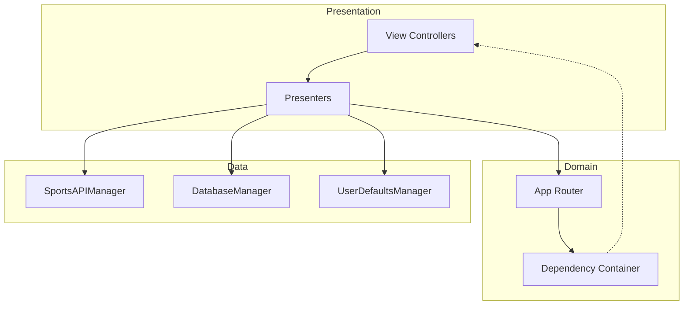
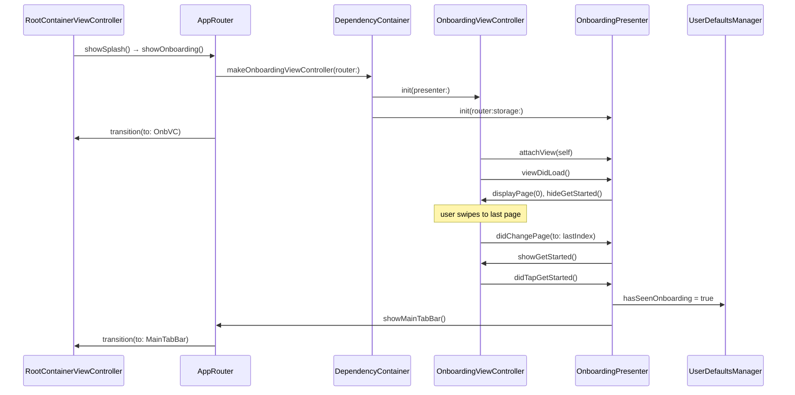
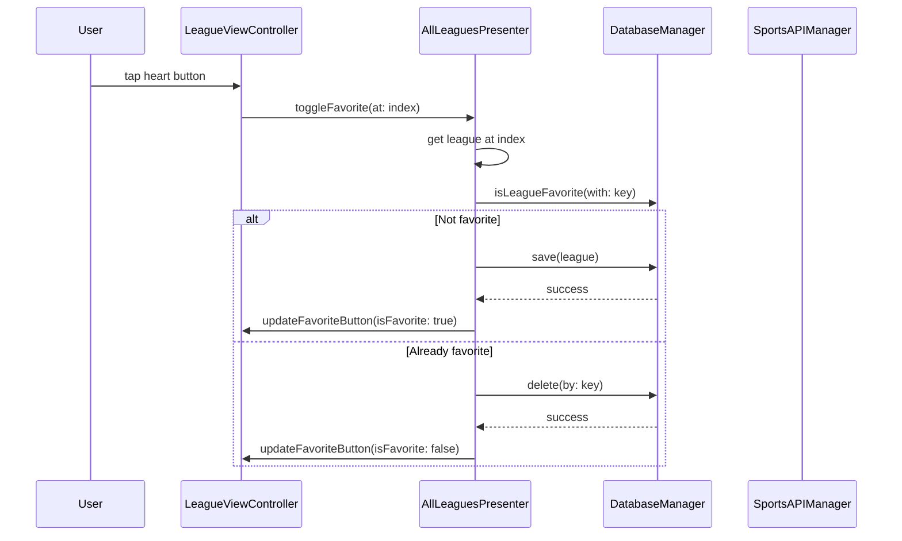
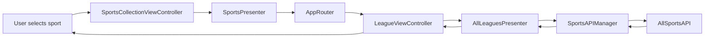
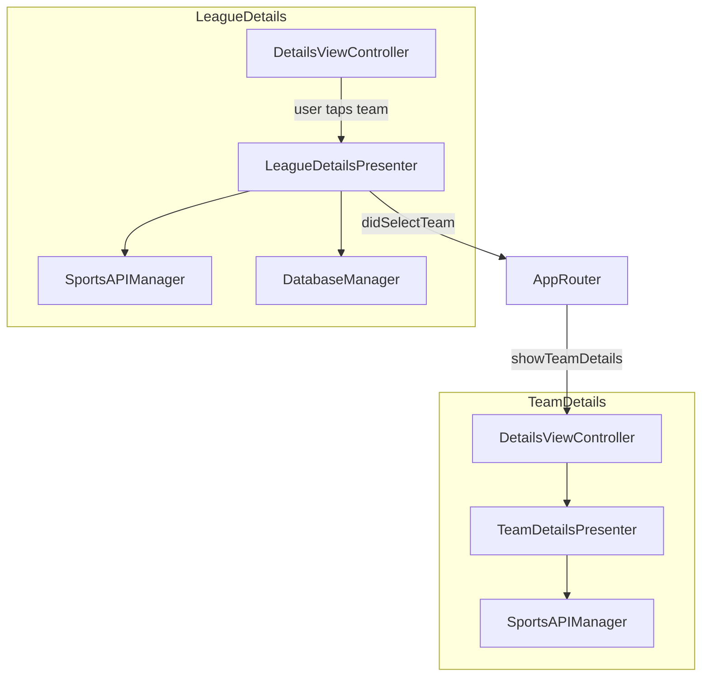
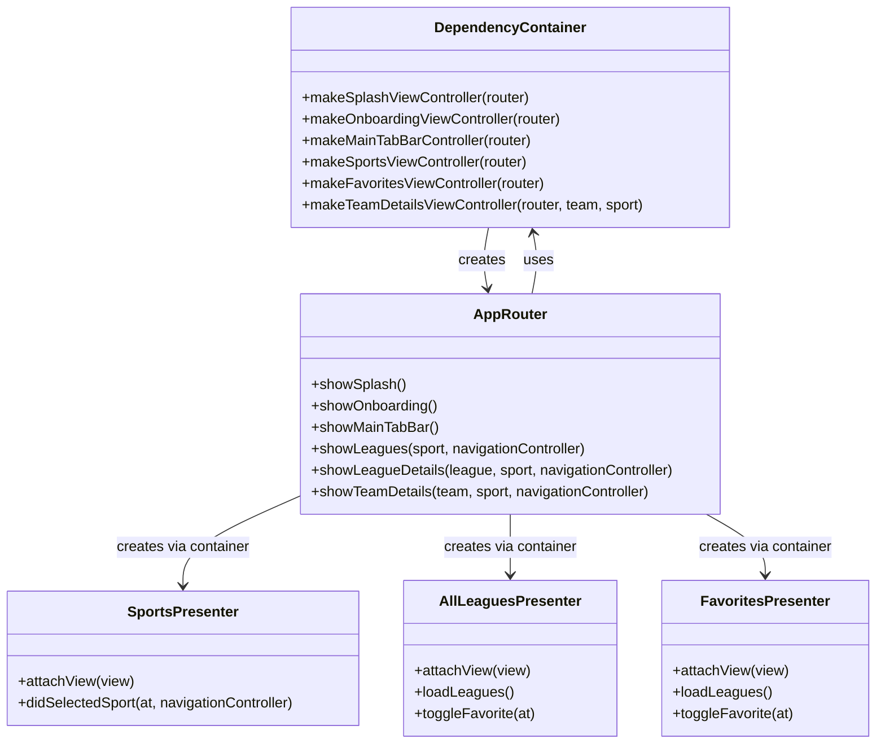
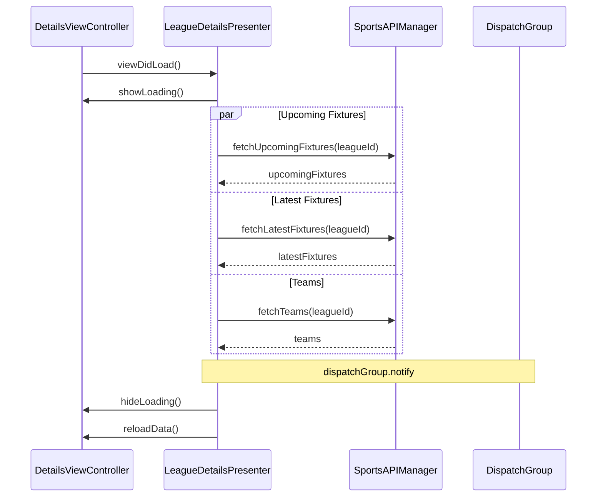

# OverTime – Sports Scores & Fixtures (MVP)

**OverTime** is an iOS MVP (Model-View-Presenter) app that delivers real‑time league standings, upcoming fixtures, latest results, and team information for **football, basketball, cricket, and tennis**. The app features a clean onboarding flow, persistent favorites using Core Data, and a modular architecture built for easy testing and maintenance.

## MVP Architecture Overview

The app follows the **Model‑View‑Presenter (MVP)** pattern with a dedicated **Router** for navigation and a **Dependency Container** for object creation.

- **Model** – Data layer: API response models (`League`, `Fixture`, `Team`), Core Data entities, and service classes (`SportsAPIManager`, `DatabaseManager`).  
- **View** – Passive `UIViewController` that displays data and forwards user actions to the Presenter.  
- **Presenter** – Contains all business logic, fetches data from services, formats it, and tells the View what to show.  
- **Router** – Handles all navigation and screen creation, decoupling the navigation logic from the Presenter.  
- **Dependency Container** – Central factory that builds modules with their dependencies.

### Component Diagram

## Onboarding Flow

## Adding a League to Favorites 

### League Fetch Flow 

## Details Screen

## Dependency Injection Container Mapping

## Network Request Parallel Execution

## Requirements

* iOS 15.0+
* Xcode 13.7+
* Swift 5.0+

## Tech Stack & Libraries

* **Architecture:** MVP (Model-View-Presenter) with programmatic routing
* **UI:** UIKit (Programmatic / Storyboards - *update this based on your app*)
* **Networking:** Native `Alamofire` 
* **Local Storage:** CoreData (Favorites), `UserDefaults` (Onboarding state)
* **Concurrency:** `DispatchGroup` for parallel API fetching

